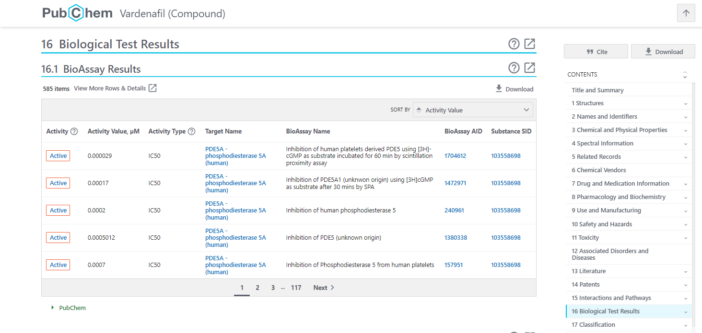

# А это преподают в мед. вузе?

Прошла зима, слышен щелчок нового оборота Сансары, тепло сходит с небес и озаряет всё вокруг солнечными зайчиками. Да-да, прошел первый месяц весны. Так давайте напомним себе, какие задачи гуляли по вкладкам наших браузеров всего пару недель назад?

Сегодня мы будем искать PDF-файл научной статьи, где представлено исследование одного лекарства с очень заковыристой формулой.

Если точнее, то задание звучит так:

_`Интересующее нас лекарство дано в следующем виде:`_

_`CCCc1nc(C)c2c(=O)nc(-c3cc(S(=O)(=O)N4CCN(CC)CC4)ccc3OCC)[nH]n12`_

_`Известно, что данное лекарство является мощным ингибитором фермента фосфодиэстеразы-5, то есть подавляет активность данного фермента. IC50 — показатель эффективности действия соединения (лекарства) на определенный фермент, в нашем случае — фосфодиэстеразу-5. IC50 показывает, сколько нужно лиганда-ингибитора для подавления активности фермента на 50%. Например, 1 наномоль лекарства необходимо, чтобы подавить активность фермента на 50%. Соответственно, для данного лекарства IC50 = 1`_

_`Необходимо найти файл pdf научной статьи об исследовании, в котором измеряли IC50 для данного лекарства к ферменту фосфодиэстераза-5 и данный показатель составляет 0.2 наномоль.`_

_`Ответ представить в виде pdf файла со статьей.`_

Уфф, звучит серьезно... Но стоит ли так бояться больших развёрнутых тасков? Может, не так страшен чёрт, как его малюют? Разберёмся!

Благодаря [maximxls](https://t.me/maximxlss), мы знаем — надо только и всего, что подойти к вопросу с правильной стороны.

Для начала, найдём поисковик, который поможет с формулой. По запросу **"search chemicals"**, Яндекс выдаёт нам ряд возможных решений, четвертый ресурс нам и нужен! &#x20;

<figure><figcaption>
Выдача Яндекса по запросу "search chemicals"
</figcaption></figure>

На сайте вводим искомую формулу, и находим некий **"Vardenafil"**.

<figure><figcaption>
Выдача специализированного поисковика по формуле
</figcaption></figure>

Переходим к нему, и ищем результаты биологического теста. Вот и наши IC50!

<figure><figcaption>
Результаты биологического теста по Vardenafil
</figcaption></figure>

Исходя из данных задания, нам надо достать результаты со значением **0.2 nM**. Погуглим?

<figure><figcaption>
Переводим нанометры в микрометры
</figcaption></figure>

И действительно, в результатах тестов есть такое значение. Переходим в его BioAssay AID, и находим строчку Primary Citation, который ведет нас к исследованию:

<figure><figcaption>
BioAssay AID результата необходимого нам теста
</figcaption></figure>

<figure><figcaption>
Исследование по результату
</figcaption></figure>

То, что доктор прописал! Только и осталось, что достать его в PDF формате. Поможет нам в этом [Sci-Hub](https://sci-hub.ru/10.1016/j.bmcl.2005.02.083).

<figure><figcaption>
Статья на Sci-Hub в формате PDF
</figcaption></figure>

Как оказалось, если немного пошерстить тематические ресурсы, они могут дать очень простые ответы на самые каверзные с виду вопросы. Не бойтесь гуглить друзья, и до новых встреч в интересных решениях!

> [@osint\_mindset](https://t.me/osint\_mindset) Канал, где вы можете узнать основные события в сообществе[\
> @forum\_rassledovaniy](https://t.me/+GMxoDCvLO0k0MWRi) Форум, где вы можете поучиться решать таски
