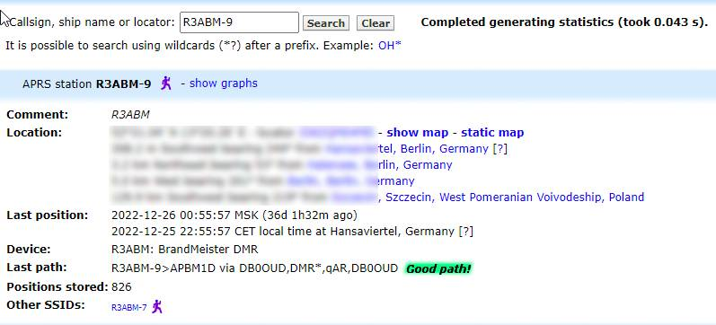

# Позывной - govn.

_@osint\_mindset Статья - X, редактор - Akvagon, March 05, 2023_

Думаю, многие знают, что мы готовились к [**OSINT mindset meetup №7**](https://t.me/osint\_mindset/211), и немного были загружены, но не смотря на все трудности, мы продолжаем радовать любимых читателей крутыми разборами интересных тасков последних дней.

До этого мы затрагивали [книги](https://osint-mindset.gitbook.io/cases/kogda-chitaesh-zapominai-oblozhku-or-osint-27), немного говорили о [крипте](https://t.me/osint\_mindset/207), сегодня же мы разберем довольно необычный для нас OSINT-таск, поехали!

**Задача:**

> Есть сайт [govn.uk.](http://govn.uk/) Необходимо найти радиолюбительский позывной создателя и его последнюю передачу местоположения по радио.

Опять любимые админы решили пошутить над форумчанами, даже не самый внимательный читатель, наверное, уже приметил благозвучность выданного ресурса. Однако, нам еще предстоит выяснить, является ли подобный нейминг всего лишь совпадением.

Первым делом мы конечно отправились шерстить сайт, чтобы изучить и проанализировать структуру и его содержание, однако наткнулись на gif-изображение северокорейского государственного, политического, партийного и военного деятеля Ким Чен Ина, мило машущего нам ладошкой.

<figure><figcaption>
gif при переходе на сайт govn.uk
</figcaption></figure>

Опять юмор? Как мы можем найти что-то на сайте, где ничего нет ничего, кроме дальневосточного вождя? Однако задание, есть задание, и мы точно знаем, что у нас есть путь к ответу, осталось его только найти. Вспомним, наши основные задачи:

> 1.Найти радиолюбительский позывной создателя

> 2.Указать последнюю передачу местоположения по радио.

Один из форумчан проявил смекалку и кое-что нарыл, а именно [http://govn.uk/shit.png](http://govn.uk/shit.png), это нам, само собой, не помогло. Очередной юмор - не таск, а сплошной смех.

<figure><figcaption>
Изображение по адресу http://govn.uk/shit.png
</figcaption></figure>

Всё это конечно весело, но пора бы и поработать. Была выдвинута версия, что сайт зарегистрирован на Artem Prilutskiy (cyanide.burnout@gmail.com) - также имеется и никнейм R3ABM (r3abm@dstar.su). Более того, человек с никнеймом R3ABM также есть на сайте www.labsk.ru, там у него юзернейм - performer. Вот, казалось бы и ответ, однако данная версия стала оспариваться, источники не указаны, откуда информация непонятно.

Следующим шагом форумчан, стала проверка данного домена на [who.is](https://who.is/whois/govn.uk) сервисе, где наш взгляд зацепился за любопытный глазу name-сервер cyanidehouse.ru, погуглив который, мы вышли на сайт [Digital Radio Amateur Technologies](http://cloud.dstar.su/bootstrap/).

<figure><figcaption>
Поиск по who.is сервису
</figcaption></figure>

А это уже интересно, есть зацепки. Мысль пошла, ребята взялись за работу. Далее, один из форумчан прояснил тот факт, что у сайта [Digital Radio Amateur Technologies](http://cloud.dstar.su/bootstrap/) есть форум [dstar.su/forum](https://www.dstar.su/forum/index.php) и более того, мы опять нашли упомянутый ранее никнейм R3ABM.

<figure><figcaption>
Форум dstar.su/forum и никнейм R3ABM
</figcaption></figure>

Мы на верном пути, осталось проанализировать форум и дать ответ, однако пока мы там рылись, [Izumrudnoe Chudovische](https://t.me/e12334444) уже решил таск.

**Ответ: 1) R3ABM 2) 52.517333, 13.337667**

**Решение:**

> Имея доменное имя, мы конечно же попробуем найти информацию о нем:

> Идем на [https://who.is/](https://who.is/) и в поисковой строке вбиваем интересующий нас ресурс и жмем на линзу

<figure><figcaption>
Поиск по who.is сервису
</figcaption></figure>

> В ответ получаем выборку регистрационных данных

<figure><figcaption>
Поиск по who.is сервису, где найден name-сервер cyanidehouse.ru.
</figcaption></figure>

> Тут я зацепился за нестандартный name-сервер cyanidehouse.ru.

> Попробовав поискать в гугле, мы получаем такую поисковую выдачу:

<figure><figcaption>
Выдача Google
</figcaption></figure>

> DSTAR.SU который является сайтом/форуме по радиолюбительскому стандарту D-STAR, что подводит нас ближе к искомому результату:

<figure><figcaption>
Сайт Digital Radio Amateur Technologies
</figcaption></figure>

> Далее, я решил зайти на dnslytics.com, который оказался третьим в поисковой выдаче, и обнаружил, что на этом ip-адресе хостятся еще несколько web-ресурсов:

<figure><figcaption>
Поиск по dnslytics.com
</figcaption></figure>

> Сразу цепляюсь за prilutsskiy.ru и за сайт представленный в punycode (xn--h1aadcewh0a1a.xn--p1ai)

> Пытаемся на него постучаться:

<figure><figcaption>
Сайт не отвечает
</figcaption></figure>

> Не получилось, но у нас есть предполагаемая фамилия радиолюбителя. Пробуем найти в гугле "Прилуцкий радиолюбитель"

<figure><figcaption>
Обратный поиск в Google по фамилии
</figcaption></figure>

> Вот мы и нашли старый и новый позывной: старый UB3ABM и новый R3ABM.

> Далее нам требуется найти последние координаты по которым R3ABM выходил на связь.

> Снова идем в гугл и ищем исключительно информацию по позывному

<figure><figcaption>
Обратный поиск в Google по позывному
</figcaption></figure>

> На qrz.ru нас встречает неприветливое сообщение о том, что для просмотра детальной информации нужна регистрация

<figure><figcaption>
Информация сайта qrz.ru
</figcaption></figure>

> Возвращаемся к поисковой выдаче и смотрим что нам выдаст [https://www.qrzcq.com/](https://www.qrzcq.com/)

<figure><figcaption>
Поиск по https://www.qrzcq.com/
</figcaption></figure>

> У нас есть координаты, но непонятно как давно они были получены.

<figure><figcaption>
Поиск детальной информации
</figcaption></figure>

> Я решил перейти на APRS Info, и посмотреть что это такое

> В новой вкладке открывается ресур aprs.fi с поиском по позывному R3ABM\*

<figure><figcaption>
Результаты выдачи
</figcaption></figure>

> У нас 2 кандидата R3ABM-7 и R3ABM-9. Поискав немного информации об обозначениях что значит -7 и -9 стало понятно, что это все один и тот же человек, просто APRS SSID может отличаться в зависимости от настройки устройства передающего информацию, либо его типа.

<figure><figcaption>
Информация по пользователю
</figcaption></figure>

> Переходим на метку, которая имеет меньший возраст, а точнее 36 дней

<figure><figcaption>
Информация по пользователю
</figcaption></figure>

> Получаем координаты: <удалены по согласованию>

<figure><figcaption>
Полученные координаты
</figcaption></figure>

> Верны ли полученные координаты?

> Возвращаемся к поисковой выдаче по позывному

<figure><figcaption>
Обратный поиск в Google
</figcaption></figure>

> Третья ссылка ведет нас на некий BrandMeister wiki.

> [https://wiki.brandmeister.network/index.php/R3ABM](https://wiki.brandmeister.network/index.php/R3ABM)

\

<figure><figcaption>
Результат выдачи
</figcaption></figure>

> Очень информативно, но ничего непонятно. Переходим по гиперссылке [BrandMeister Dev Team](https://brandmeister.network/?page=team) где видим что R3ABM так же является ведущим разработчиком в BrandMeister, проживает в Берлине, Германия и еще один его позывной DL5ABM.

<figure><figcaption>
Интересующий пользователь
</figcaption></figure>

Таким образом мы видим, что даже самая смешная задача не является легкой.\
Подходите к задачам с разных сторон, не бойтесь пробовать, и у вас обязательно все получится. А на сегодня все, друзья, до новых встреч в интересных решениях!

> [@osint\_mindset](https://t.me/osint\_mindset) Канал, где вы можете узнать основные события в сообществе[\
> @forum\_rassledovaniy](https://t.me/+GMxoDCvLO0k0MWRi) Форум, где вы можете поучиться решать таски
